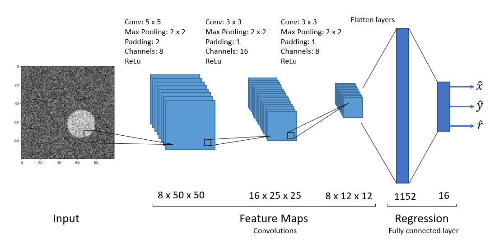

# Circle_CNN

 

# :memo: Description

This project sets up a relatively simple task for a ConvNN to perform a regression task. Images contain a circle or random size and position. The goal is to output the position (x,y) and the radius r of the circle for varying levels of noise in the images. Two models are built and compared. The full write up is either found in the model_evaluation.ipynb or in my [portfolio](https://sebastianghafafian.github.io/Portfolio/Circle_CNN.html).

# :open_file_folder: Data Set

The training data contains 40000 images of 100 x 100 pixels binary images.

# :page_facing_up: Script overview
| Script | Function |
|---|---|
|model_evalutation.ipynb	|Analysis of model performance				|
|create_dataset.py 		|Outputs a .zip file of 40000 binary images		|
|networks.py 			|Defines the model architectures			|
|utils.py 			|Contains functions for creation and loading of dataset	|
|training_kaggle.ipynb 		|Trains model on Kaggle.com				|

# :chart_with_downwards_trend: Model training
The model training (training_kaggle.ipynb) is done using Kaggle to use cuda. 
To run a notebook on Kaggle.com, follow these steps:
